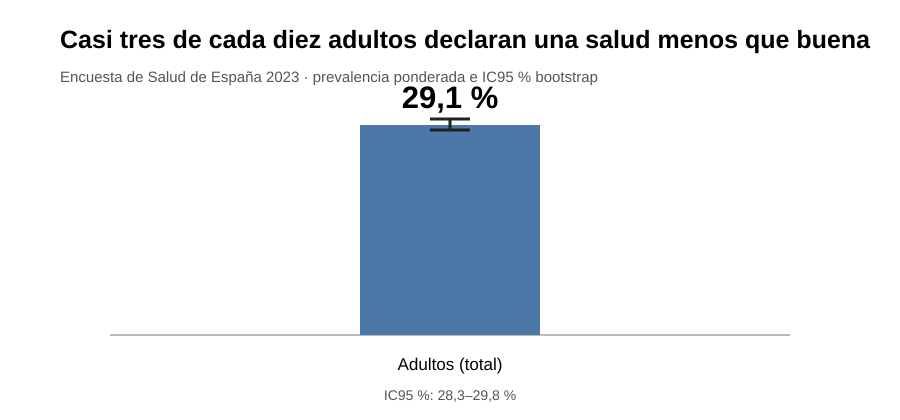
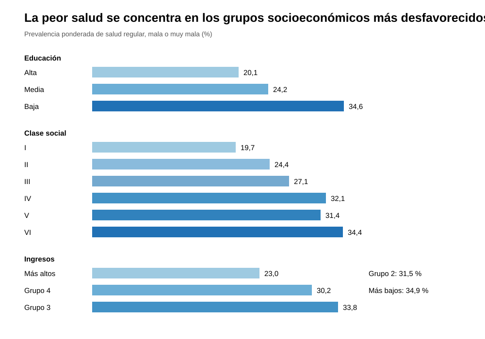
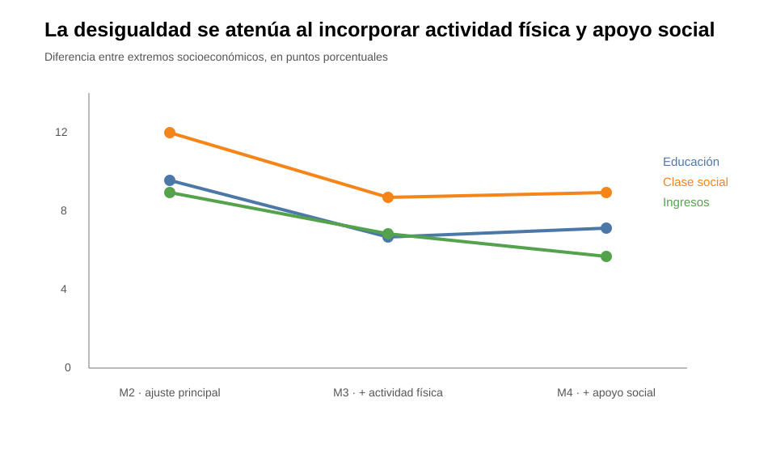

# Tu posición social también se refleja en tu salud

## Qué revela la Encuesta de Salud de España 2023 sobre las desigualdades sociales

¿Por qué dos personas que viven en el mismo país pueden describir su salud de forma tan diferente? La edad y el sexo importan, pero los datos de la Encuesta de Salud de España 2023 muestran que la posición socioeconómica también está estrechamente relacionada con cómo las personas perciben su estado de salud.

Este análisis estudia 21.032 adultos y utiliza los factores de ponderación de la encuesta para aproximar los resultados a la población. El indicador principal reúne a quienes calificaron su salud como regular, mala o muy mala. En el conjunto de la población analizada, la prevalencia ponderada fue del **29,1 %** (IC95 % bootstrap: **28,3–29,8 %**).

Dicho de otra manera: aproximadamente tres de cada diez adultos declaran una salud que no consideran buena. Pero ese promedio nacional oculta diferencias importantes.

## La salud sigue un gradiente social

Las diferencias aparecen al ordenar a la población por educación, clase social e ingresos.

Entre las personas con nivel educativo alto, el **20,1 %** declara una salud regular, mala o muy mala. La cifra asciende al **24,2 %** entre quienes tienen educación media y alcanza el **34,6 %** en el nivel educativo bajo.

La clase social muestra un patrón parecido. La prevalencia es del **19,7 %** en la clase I y alcanza el **34,4 %** en la clase VI. No todas las categorías intermedias forman una escalera perfecta, pero la distancia entre los extremos es clara.

También aparece una brecha por ingresos. En el grupo de mayores ingresos, la prevalencia es del **23,0 %**; en el grupo de menores ingresos llega al **34,9 %**.

Estas cifras son prevalencias observadas y ponderadas. Por sí solas no permiten afirmar que tener menos estudios o ingresos cause peor salud. Parte de las diferencias podría deberse, por ejemplo, a que los grupos socioeconómicos tienen distinta estructura de edad.

> **¿Qué es una prevalencia?**  
> Es la proporción de personas de un grupo que presenta una determinada característica. Aquí indica qué porcentaje declara una salud regular, mala o muy mala.

## ¿Qué ocurre cuando comparamos perfiles más parecidos?

Para separar parcialmente esos factores se utilizaron modelos ajustados. El modelo principal (M2) controla por edad, sexo, país de nacimiento y comunidad autónoma.

Después del ajuste, la desigualdad no desaparece.

En educación, la prevalencia ajustada es del **21,3 %** en el nivel alto y del **31,0 %** en el nivel bajo: una diferencia de **9,7 puntos porcentuales**. Su intervalo de confianza del 95 % va aproximadamente de **7,8 a 11,7 puntos**.

En clase social, la diferencia entre los extremos es aún mayor: **21,5 %** frente a **33,7 %**, una brecha ajustada de **12,2 puntos porcentuales** (IC95 %: **9,6–14,9**).

En ingresos, el grupo de mayores ingresos presenta una prevalencia ajustada del **24,7 %**, frente al **34,3 %** del grupo de menores ingresos. La diferencia es de **9,6 puntos** (IC95 %: **6,9–12,3**).

Otra forma de expresarlo es mediante razones de prevalencias. Tras el ajuste, el grupo educativo bajo presenta una prevalencia aproximadamente **1,46 veces** la del nivel alto; la clase social VI, **1,57 veces** la de la clase I; y el grupo de menores ingresos, **1,39 veces** la del grupo de mayores ingresos.

> **¿Qué significa “ajustar”?**  
> El modelo intenta comparar grupos haciendo estadísticamente equivalentes determinadas características. No convierte el estudio en un experimento ni demuestra causalidad, pero permite comprobar si la asociación persiste después de considerar variables importantes.

> **¿Qué es un intervalo de confianza?**  
> Expresa la incertidumbre de una estimación. Un intervalo más estrecho indica mayor precisión. No debe interpretarse como una garantía absoluta sobre el valor verdadero.

## Actividad física y apoyo social: parte de la historia

El análisis añadió después actividad física (M3) y apoyo social (M4). Para hacer esta comparación correctamente se utilizó una muestra común en cada indicador, evitando que los cambios entre modelos se debieran simplemente a analizar personas distintas.

En educación, la diferencia entre los extremos pasa de **9,57 puntos** en M2 a **6,67** al incorporar actividad física y queda en **7,14** al incorporar también apoyo social.

En clase social pasa de **11,98** a **8,68** y después a **8,92 puntos**.

En ingresos, la reducción es de **8,95** a **6,87** y finalmente a **5,74 puntos**.

El mensaje requiere cautela. Estos resultados **no demuestran que la actividad física o el apoyo social sean la causa de la desigualdad ni permiten calcular qué porcentaje de ella “explican”**. Sí muestran que la brecha estimada se reduce cuando estas variables se incorporan al modelo. Además, en educación y clase social M4 queda ligeramente por encima de M3, por lo que la atenuación no es perfectamente lineal.

## Lo que estos datos no pueden demostrar

La Encuesta de Salud de España 2023 proporciona una fotografía transversal. La posición socioeconómica y la salud se observan esencialmente en el mismo periodo. Por ello, el análisis identifica **asociaciones**, no relaciones causales demostradas.

Existen además mecanismos en ambas direcciones. Una posición socioeconómica desfavorable podría contribuir a una peor salud mediante condiciones de trabajo, vivienda, alimentación, estrés, acceso a recursos o hábitos. Pero una mala salud también puede limitar el empleo y reducir los ingresos.

Tampoco es posible descartar todos los factores de confusión. El ajuste estadístico mejora la comparación, pero no reproduce las condiciones de un experimento.

## Una desigualdad que permanece visible

La conclusión principal es sencilla: **la salud autopercibida en España presenta un marcado gradiente socioeconómico**.

Las personas con menor educación, pertenecientes a clases sociales más desfavorecidas o situadas en los grupos de menores ingresos declaran con mayor frecuencia una salud regular, mala o muy mala. Las diferencias disminuyen al tener en cuenta características demográficas y algunos factores sociales y conductuales, pero no desaparecen.

Esto tiene una implicación importante para la salud pública. Si las desigualdades persisten entre personas estadísticamente comparables en edad, sexo, origen y territorio, estudiar la salud únicamente desde la asistencia sanitaria resulta insuficiente. Las condiciones sociales en las que las personas estudian, trabajan y viven forman parte del problema que los datos permiten observar.

La encuesta no demuestra por sí sola qué intervención reduciría esas diferencias. Pero sí ofrece una señal suficientemente consistente para justificar análisis posteriores y políticas que evalúen la salud junto con sus determinantes sociales.

---

### Nota metodológica

Análisis de **21.032 adultos** de la Encuesta de Salud de España 2023. Se emplearon ponderaciones de encuesta. Las prevalencias e intervalos mostrados proceden de los resultados reproducibles versionados en el repositorio. Los intervalos y contrastes utilizados se calcularon con **1.000 réplicas bootstrap** en los archivos actualmente publicados. Los modelos M2 ajustan por edad, sexo, país de nacimiento y comunidad autónoma; M3 incorpora actividad física y M4 apoyo social. Los análisis M2→M4 de atenuación utilizan muestras comunes dentro de cada exposición.

[Volver al README del proyecto](../README.md)
